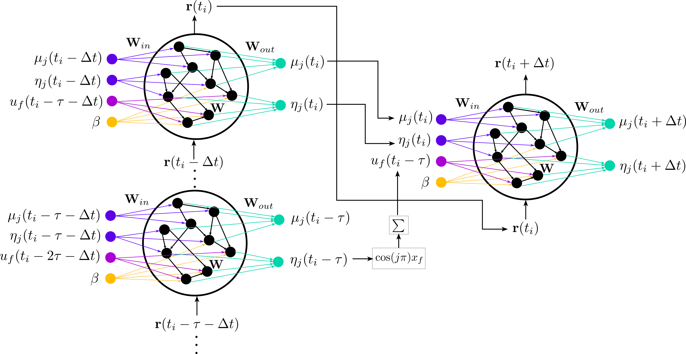

# Adjoint-ESN: Data-driven inference of adjoint sensitivities of nonlinear flows

 Repository for [<em>Data-driven computation of adjoint sensitivities without adjoint solvers: An application to thermoacoustics</em>, Phys. Rev. Fluids 9, 103902, D.E. Ozan and L. Magri (2024)](https://arxiv.org/abs/2404.11738) and [<em>Adjoint Sensitivities of Chaotic Flows without Adjoint Solvers: A Data-Driven Approach</em>, Proceedings of International Conference on Computational Science, D.E. Ozan and L. Magri (2024).](https://arxiv.org/abs/2404.12315). 
 
 Adjoint methods offer a computationally cheap and accurate way to calculate the sensitivity of a quantity of interest with respect to the system parameters. 
 However, the accuracy of the adjoint relies on the physical model of the underlying system, which can be high-dimensional and highly nonlinear.  We propose a computational strategy to infer the adjoint 
 sensitivities from data when the governing equations might be unknown (or partly unknown), and noise might be present. The key component of this strategy is an echo state network, which learns the dynamics of 
 nonlinear regimes with varying parameters, and it evolves dynamically via a hidden state. 
 

  

In this repository, we consider two nonlinear systems that are of interest to fluids applications and demonstrate the proposed strategy: (i) Lorenz 63 system, which is a prototypical system exhibiting chaos (see [tutorial_lorenz63.ipynb](https://github.com/MagriLab/Adjoint-ESN/blob/main/tutorial_lorenz63.ipynb)), and (ii) the Rijke tube, which is a fundamental model for studying thermoacoustics (see [tutorial_rijke.ipynb](https://github.com/MagriLab/Adjoint-ESN/blob/main/tutorial_rijke.ipynb)). While for the Lorenz 63 system we utilize the classic ESN architecture that has been extended for the parameter-varying case, we develop so-called Thermoacoustic ESNs (shown in the above figure) for the Rijke tube, which take into account the time-delayed dynamics of thermoacoustics. 

The tutorials show step by step data generation, training, validation and sensitivity calculations. Individual scripts in src folder can be run for training and validation by modifying the provided config files, these scripts save the results, which can later be imported for further calculations. 

 
